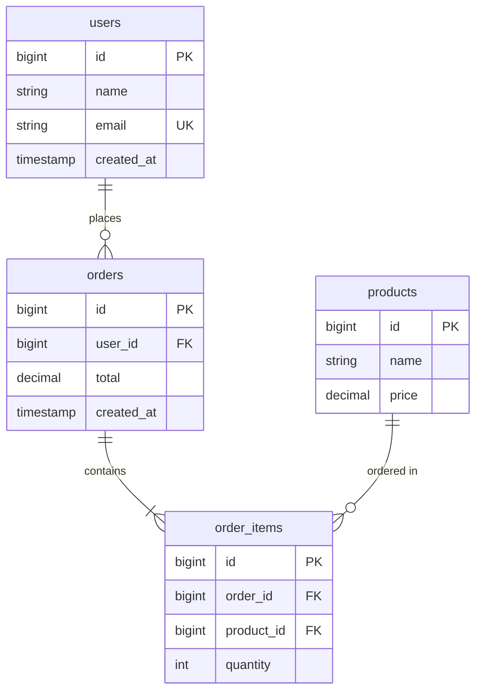
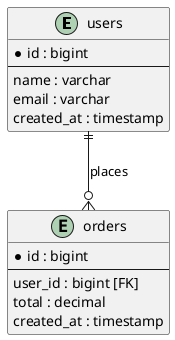

## Task

Analyze Laravel migrations and Eloquent models to generate a visual database schema diagram.

## Input

- **format** (optional): Output format — `mermaid` (default), `dbml`, `plantuml`
- **tables** (optional): Comma-separated table names to include; all by default

## Steps

1. **Read Migrations**
   ```bash
   find database/migrations -name "*.php" -type f
   ```
   - Parse table definitions, columns, indexes, foreign keys
   - Identify relationships (foreign key constraints)

2. **Analyze Models**
   - Extract model relationships (hasMany, belongsTo, belongsToMany, hasOne)
   - Map relationship directions and cardinalities
   - Detect pivot tables and through relationships

3. **Detect Schema Properties**
   - Column types and constraints (nullable, unsigned, default)
   - Primary and unique keys
   - Indexes and composite keys
   - Foreign key relationships and cascade options

4. **Generate Diagram**
   - Render in chosen format (Mermaid ERD, DBML, PlantUML)
   - Show all tables and relationships
   - Include column details (types, keys)
   - Render cardinalities (one-to-many, many-to-many, etc.)

## Output Format

### Mermaid (default)
Renders natively in GitHub, GitLab, Notion, and VS Code.



### DBML
Export to dbdiagram.io for interactive editing and collaboration.

```dbml
Table users as U {
  id bigint [primary key]
  name varchar
  email varchar [unique]
  created_at timestamp
}

Table orders as O {
  id bigint [primary key]
  user_id bigint [ref: > U.id]
  total decimal
  created_at timestamp
}

Table order_items as OI {
  id bigint [primary key]
  order_id bigint [ref: > O.id]
  product_id bigint [ref: > P.id]
  quantity int
}

Table products as P {
  id bigint [primary key]
  name varchar
  price decimal
}
```

### PlantUML
For documentation systems and static generation.



## Reference

See `${CLAUDE_SKILL_DIR}/references/` for:
- `mermaid-erd.md` — Mermaid ERD syntax and relationship cardinalities
- `dbml-syntax.md` — DBML format for dbdiagram.io

## Options

```bash
# Generate full schema in Mermaid
/db:diagram

# Generate specific tables
/db:diagram mermaid users,orders,products

# Generate in DBML format
/db:diagram dbml

# Generate in PlantUML
/db:diagram plantuml
```
