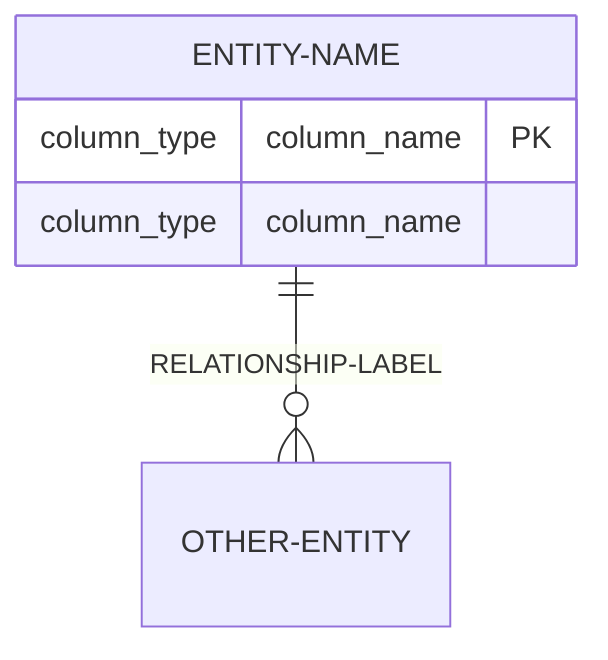
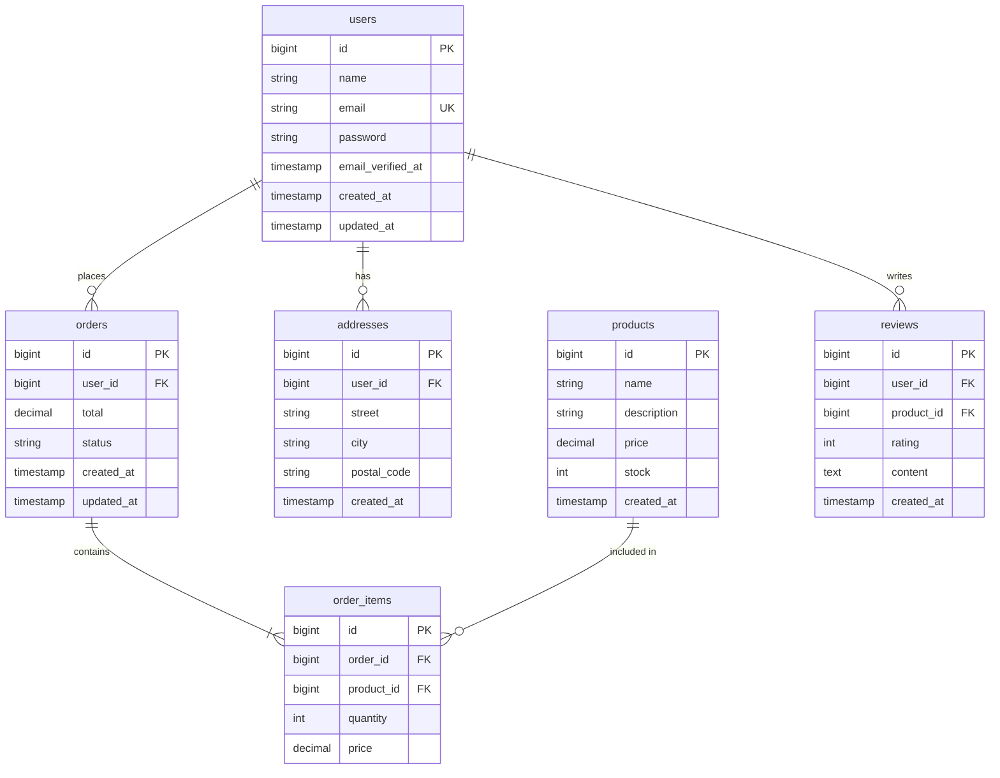

# Mermaid ERD Syntax

## Relationship Cardinalities

| Cardinality | Syntax | Meaning |
|-------------|--------|---------|
| One-to-one | `\|\|--\|\|` | One entity relates to exactly one |
| One-to-many | `\|\|--o{` | One entity relates to many |
| Many-to-one | `}o--\|\|` | Many entities relate to one |
| Many-to-many | `}o--o{` | Many relate to many |

## Basic Syntax



## Key Indicators

- `PK` — Primary key
- `FK` — Foreign key
- `UK` — Unique key

## Full Example



## Rendering Notes

- Mermaid renders ERDs in GitHub, GitLab, Notion, and modern editors
- Cardinalities are directional — the relationship flows from left to right
- Use quotes for multi-word relationship labels: `"places orders"`
- Column order matters for readability — put keys first

## Laravel Relationship Mapping

| Laravel Relationship | Cardinality | Syntax |
|----------------------|------------|--------|
| `hasMany()` | One-to-many | `users \|\|--o{ orders` |
| `belongsTo()` | Many-to-one | `orders }o--\|\| users` |
| `hasOne()` | One-to-one | `users \|\|--\|\| profile` |
| `belongsToMany()` | Many-to-many | `users }o--o{ roles` (via pivot) |

## Column Type Examples

```
string — VARCHAR
text — TEXT (long text)
bigint — BIGINT (unsigned for ID)
int — INTEGER
decimal(8,2) — DECIMAL with precision
boolean — BOOLEAN
timestamp — TIMESTAMP
date — DATE
json — JSON
enum — ENUM (for fixed values)
```
